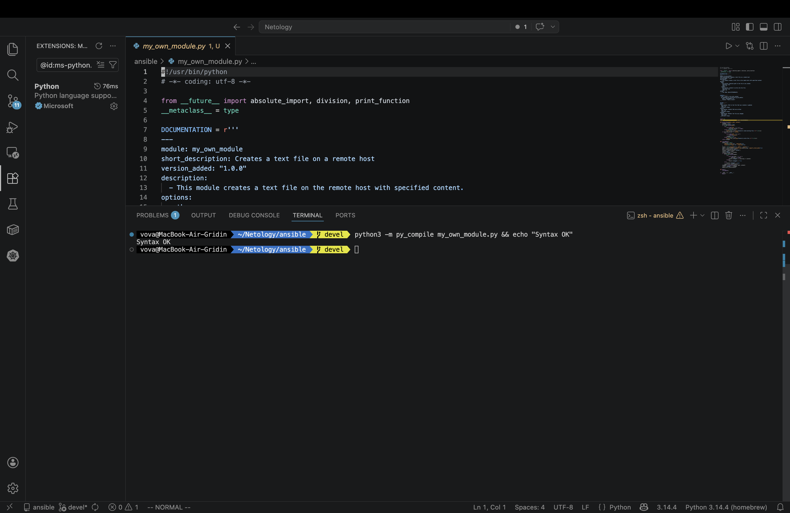
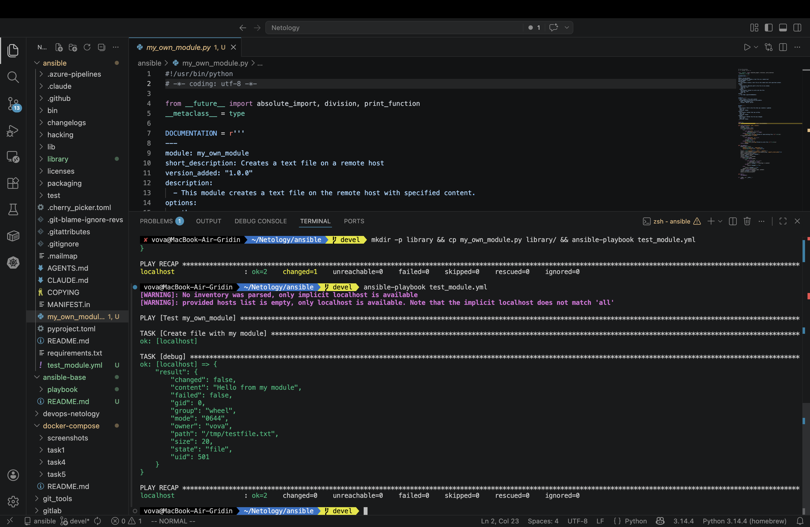
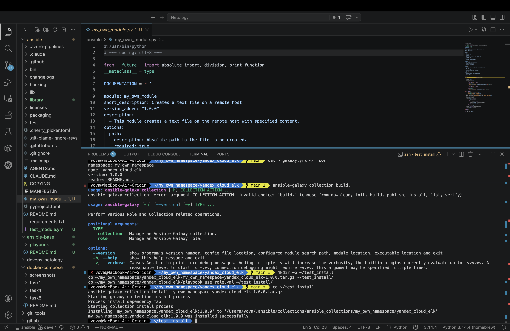
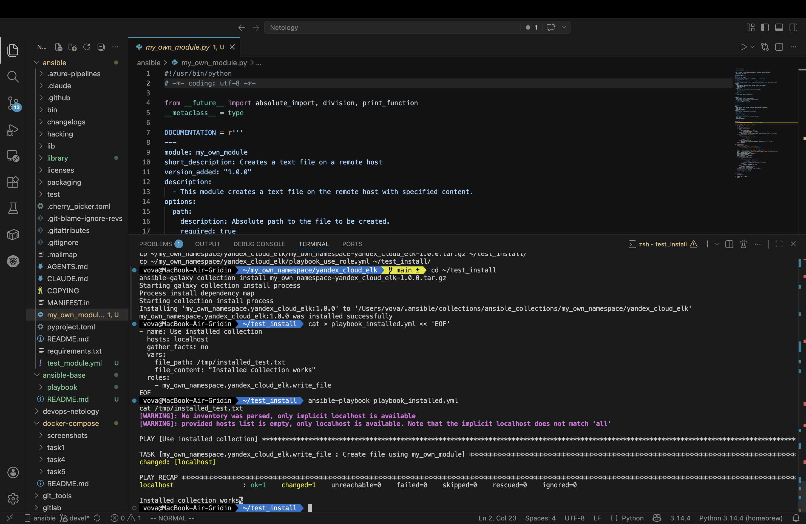

# Домашнее задание к занятию 6 «Создание собственных модулей»

## Выполнил Гридин Владимир

## Выполненные шаги

1. **Создан модуль `my_own_module`**  

   Модуль создаёт текстовый файл на удалённом хосте с заданным содержимым.  

   Параметры: `path` (путь к файлу), `content` (содержимое).

2. **Локальная проверка модуля**  

   Модуль протестирован с помощью playbook `test_module.yml`.  

   Скриншот проверки синтаксиса и первого запуска:  

   

3. **Идемпотентность**  

   Повторный запуск playbook не изменяет файл (`changed: false`).  

   Скриншот второго запуска:  

   

4. **Создание коллекции**  

   Коллекция `my_own_namespace.yandex_cloud_elk` содержит модуль и роль `write_file`.

5. **Сборка коллекции**  

   Архив коллекции:  

   [my_own_namespace-yandex_cloud_elk-1.0.0.tar.gz](https://github.com/DimirDin/my_own_collection/releases/download/1.0.0/my_own_namespace-yandex_cloud_elk-1.0.0.tar.gz)  

6. **Установка коллекции из локального архива**  

   Команда:
  
   ```bash
   ansible-galaxy collection install my_own_namespace-yandex_cloud_elk-1.0.0.tar.gz
   ```

Скриншот успешной установки:

   

Запуск playbook с установленной коллекцией

Playbook использует роль my_own_namespace.yandex_cloud_elk.write_file.

Скриншот выполнения и проверки содержимого файла:

   

Структура коллекции

my_own_namespace/yandex_cloud_elk/
├── galaxy.yml
├── README.md
├── plugins/
│   └── modules/
│       └── my_own_module.py
├── roles/
│   └── write_file/
│       ├── defaults/
│       │   └── main.yml
│       └── tasks/
│           └── main.yml
└── playbook_use_role.yml

Использование

Установка коллекции

```bash
ansible-galaxy collection install my_own_namespace-yandex_cloud_elk-1.0.0.tar.gz
```

Пример playbook

yaml
- name: Use installed collection
  hosts: localhost
  vars:
    file_path: /tmp/example.txt
    file_content: "Hello from collection"
  roles:
    - my_own_namespace.yandex_cloud_elk.write_file

